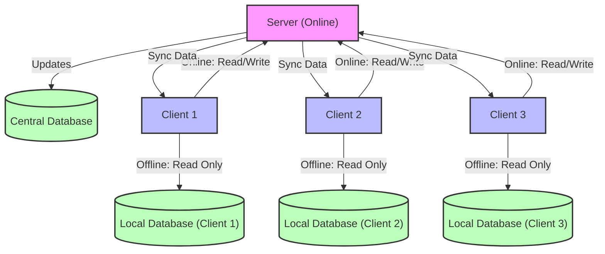

## 前言
为了实现下图里的架构，我们需要实现 MySQL 的主从复制。

项目需求可以总结为以下逻辑：  

1. **客户端启动时的模式选择**：  
   - 检测服务器状态：  
     - 如果服务器在线，客户端以**在线模式**登录，能够写入服务器数据库。  
     - 如果服务器不在线或通信中断，客户端以**离线模式**登录，仅能读取本地数据库，不能写入。

2. **服务器在线时的同步逻辑**：  
   - 服务器检测数据库更新，将变动数据同步到所有客户端的本地数据库。

3. **数据一致性和冲突处理**：  
   - 客户端离线时，无法写入数据库，避免了数据冲突问题。

参考链接：https://zhuanlan.zhihu.com/p/685697386

## 对比总结
从 MySQL5.6 开始，主从复制有两种方式：基于日志（binlog）、基于 GTID（全局事务标示符）。两者无法同时使用。

| 特性                    | 基于 GTID 的复制                    | 基于日志文件及位置的复制          |
|-------------------------|------------------------------------|----------------------------------|
| **断点续传**            | 自动完成，易管理                   | 手动指定，操作复杂               |
| **主从切换**            | 简单灵活，适合高可用场景           | 操作繁琐，容易出错               |
| **事务一致性**          | 全局唯一，便于审计                 | 无法保证全局一致性               |
| **性能开销**            | 略高                              | 较低                             |
| **兼容性**              | 受限于事务性操作和存储引擎         | 高兼容性，适用所有操作和引擎      |
| **配置复杂度**          | 较高                              | 较低                             |
| **适用场景**            | 大规模、高可用、复杂复制环境       | 传统、简单主从复制场景           |

## 操作步骤
### 1. **环境准备**
确保主服务器和从服务器都已安装MySQL，并能通过网络互相通信。

- 主服务器：`Master`
- 从服务器：`Slave`

### 2. **主服务器配置**
在主服务器上进行以下操作：

#### 2.1 编辑 MySQL 配置文件
  - Windows 下，默认配置文件路径是 `C:\ProgramData\MySQL\MySQL Server 8.0\my.ini` 
  - Linux 下，配置文件路径可能是 `/etc/my.cnf` 或 `/etc/mysql/my.cnf`。
<details><summary>不记得MySQL的安装路径？</summary>
<p>

> 使用 `mysqld --verbose --help`命令，该命令会输出很多关于 mysqld (MySQL 服务器) 的信息，其中包括默认的配置文件路径以及实际读取的配置文件路径。

</p>
</details>  
添加或修改以下内容：（注意：挨个搜索，确定没有，再在mysqld下添加，配置文件中如server-id可能已设置过了）

 - 基于日志 
    ```ini             
    [mysqld]                                                               
    log-bin=mysql-bin                  # 服务器SQL操作会存在以 mysql-bin 为名的文件中                     
    server-id=1                        # 唯一标识主服务器的ID（大于0的整数） 
    #################################### 以下可选      
    binlog-do-db=要同步的数据库名       # 可选，只记录该数据库的操作到二进制日志 
    binlog-ignore-db=要忽略的数据库名1  # 可选，忽略不需要同步数据库（可重复） 
    binlog-ignore-db=要忽略的数据库名2                                      
    ```
 - 基于 GTID 
    ```ini
    [mysqld]
    gtid_mode=ON                         # 开启 GTID 模式
    enforce_gtid_consistency=ON          # 强制 GTID 一致性
    log_bin=ON                           # 开启 binlog 日志
    binlog_format=ROW                    # 使用 ROW 模式的二进制日志格式
    server_id=1                          # 唯一标识主服务器的ID（大于0的整数）
    ###################################### 以下可选      
    binlog-do-db=要同步的数据库名         # 可选，只记录该数据库的操作到二进制日志 
    binlog-ignore-db=要忽略的数据库名1    # 可选，忽略不需要同步数据库（可重复） 
    binlog-ignore-db=要忽略的数据库名2          
    ```                                                            

#### 2.2 重启 MySQL 服务
- Windows 下， win+R 输入 services.msc ，找到 MySQL80 服务，右键菜单中选择重新启动
- Linux 下，执行命令
    ```bash
    sudo systemctl restart mysql
    ```

#### 2.3 创建复制用户
在 MySQL 中给从服务器创建一个用户。（如果是“一主多从”的情况，需要创建多个用户）

```sql
CREATE USER 'repl'@'%' IDENTIFIED WITH mysql_native_password BY 'your_password';
GRANT REPLICATION SLAVE ON *.* TO 'repl'@'%'; -- 只给从服务器复制权限，当主服务器增删表时，从服务器有可能同步出错
-- GRANT ALL PRIVILEGES ON *.* TO 'repl'@'%' WITH GRANT OPTION; 
-- 授予 repl 用户对所有数据库 (*.*) 的所有权限，并且他能将这些权限授予其他用户 （谨慎操作）
FLUSH PRIVILEGES;
```

#### 2.4 查看主服务器状态
获取二进制日志文件名和位置：

```sql
SHOW MASTER STATUS;
```

记下结果中的 `File` 和 `Position`，例如：
- File: `mysql-bin.000001`
- Position: `154`


### 3. **从服务器配置**
在从服务器上进行以下操作：

#### 3.1 编辑 MySQL 配置文件
修改从服务器的配置文件：
- 基于日志
    ```ini
    [mysqld]
    server-id=2                        # 唯一标识从服务器的ID（不同于主服务器）
    #################################### 以下可选      
    binlog-do-db=要同步的数据库名       # 可选，只同步服务器上该数据库
    binlog-ignore-db=要忽略的数据库名1  # 可选，忽略不希望从服务器同步的数据库（可重复） 
    binlog-ignore-db=要忽略的数据库名2    
    ```
- 基于GTID
    ```ini
    [mysqld]
    server-id = 3                      # 确保 server-id 唯一
    log_bin = ON                       # 开启 binlog 日志
    gtid_mode = ON                     # 开启 GTID 模式
    enforce_gtid_consistency = ON      # 强制 GTID 一致性
    binlog_format = ROW                # 使用 ROW 模式的二进制日志格式
    relay_log = relay-bin              # 指定 relay log 文件前缀
    #################################### 以下可选      
    binlog-do-db=要同步的数据库名       # 可选，只同步服务器上该数据库
    binlog-ignore-db=要忽略的数据库名1  # 可选，忽略不希望从服务器同步的数据库（可重复） 
    binlog-ignore-db=要忽略的数据库名2  
    ```

#### 3.2 重启 MySQL 服务

参照 2.2

#### 3.3 配置同步
在从服务器的 MySQL 命令行中，运行以下命令：

- 基于日志
    ```sql
    CHANGE MASTER TO
        MASTER_HOST='主服务器IP地址',
        MASTER_USER='repl',
        MASTER_PASSWORD='your_password',
        MASTER_LOG_FILE='mysql-bin.000001',  -- 使用主服务器状态中的File值
        MASTER_LOG_POS=154;                 -- 使用主服务器状态中的Position值

    START SLAVE;
    ```
- 基于GTID
    ```sql
    CHANGE MASTER TO 
        MASTER_HOST='主服务器IP地址',
        MASTER_USER='repl',
        MASTER_PASSWORD='your_password',
        MASTER_PORT=3306,
        MASTER_AUTO_POSITION=1; -- 或者 MASTER_LOG_POS=14221; 

    START SLAVE;
    ```

#### 3.4 检查同步状态
查看从服务器的同步状态：

```sql
SHOW SLAVE STATUS;
```

确认以下两项都为 `Yes`：
- `Slave_IO_Running: Yes`
- `Slave_SQL_Running: Yes`

---

### 4. **验证主从同步**
在主服务器上创建或修改数据库内容，并检查从服务器是否同步。