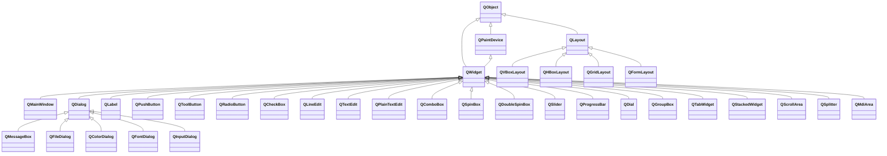

```mermaid
classDiagram
    %% 核心基类
    class QObject
    class QPaintDevice
    class QWidget

    QObject <|-- QPaintDevice
    QObject <|-- QWidget
    QPaintDevice <|-- QWidget

    %% 顶层窗口类
    class QMainWindow
    class QDialog
    class QMessageBox
    class QFileDialog
    class QColorDialog
    class QFontDialog
    class QInputDialog

    QWidget <|-- QMainWindow
    QWidget <|-- QDialog
    QDialog <|-- QMessageBox
    QDialog <|-- QFileDialog
    QDialog <|-- QColorDialog
    QDialog <|-- QFontDialog
    QDialog <|-- QInputDialog

    %% 常用控件类
    class QLabel
    class QPushButton
    class QToolButton
    class QRadioButton
    class QCheckBox
    class QLineEdit
    class QTextEdit
    class QPlainTextEdit
    class QComboBox
    class QSpinBox
    class QDoubleSpinBox
    class QSlider
    class QProgressBar
    class QDial

    QWidget <|-- QLabel
    QWidget <|-- QPushButton
    QWidget <|-- QToolButton
    QWidget <|-- QRadioButton
    QWidget <|-- QCheckBox
    QWidget <|-- QLineEdit
    QWidget <|-- QTextEdit
    QWidget <|-- QPlainTextEdit
    QWidget <|-- QComboBox
    QWidget <|-- QSpinBox
    QWidget <|-- QDoubleSpinBox
    QWidget <|-- QSlider
    QWidget <|-- QProgressBar
    QWidget <|-- QDial

    %% 容器控件类
    class QGroupBox
    class QTabWidget
    class QStackedWidget
    class QScrollArea
    class QSplitter
    class QMdiArea

    QWidget <|-- QGroupBox
    QWidget <|-- QTabWidget
    QWidget <|-- QStackedWidget
    QWidget <|-- QScrollArea
    QWidget <|-- QSplitter
    QWidget <|-- QMdiArea

    %% 布局类（不继承 QWidget）
    class QLayout
    class QVBoxLayout
    class QHBoxLayout
    class QGridLayout
    class QFormLayout

    QObject <|-- QLayout
    QLayout <|-- QVBoxLayout
    QLayout <|-- QHBoxLayout
    QLayout <|-- QGridLayout
    QLayout <|-- QFormLayout
```