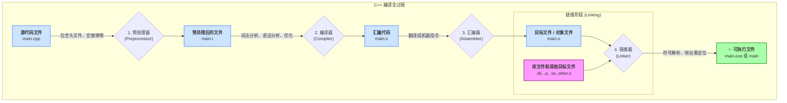

C++ 的编译过程通常可以分为四个主要阶段：

1. 预处理（Preprocessing）
2. 编译（Compilation）
3. 汇编（Assembly）
4. 链接（Linking）

下面以一个简单的 C++ 程序为例，逐步剖析这个过程。
```c++
#include <iostream>

#define GREETING "Hello, C++!"

int main() {
    std::cout << GREETING << std::endl;
    return 0;
}
```

预处理
好的！我们来探秘 C++ 编译的过程，用通俗的中文讲解，尽量清晰简洁，同时深入剖析关键点。如果有具体问题或想深入某部分，随时告诉我！

### C++ 编译过程概览
C++ 程序从源代码（`.cpp` 文件）到可执行文件（`.exe` 或其他格式），需要经过几个关键步骤。这个过程通常由 **编译器**（如 GCC、Clang、MSVC）完成，主要包括以下四个阶段：

1. **预处理 (Preprocessing)**
2. **编译 (Compilation)**
3. **汇编 (Assembly)**
4. **链接 (Linking)**

为了更直观地理解，以下是 C++ 编译过程的示意图：

[](https://icarus.cs.weber.edu/~dab/cs1410/textbook/1.Basics/images/compiler.png)


下面我们逐一拆解这些步骤，带你看看代码背后发生了什么。

---

### 1. 预处理 (Preprocessing)
**这是编译的第一步，处理源代码中的“宏指令”和预处理器命令。**

- **做什么？**
  - 处理以 `#` 开头的指令，比如 `#include`、`#define`、`#ifdef` 等。
  - 展开宏定义（把宏替换为实际内容）。
  - 删除注释（代码中的 `//` 或 `/* */` 会被移除）。
  - 处理条件编译（根据 `#ifdef`、`#else` 等决定哪些代码保留）。
  - 将 `#include` 的头文件内容插入到源文件中。

- **例子：**
  假设你有以下代码：
  ```cpp
  #include <iostream>
  #define MAX 100
  int main() {
      std::cout << MAX << std::endl;
      return 0;
  }
  ```
  预处理器会：
  - 把 `#include <iostream>` 替换为 `iostream` 头文件的实际内容（一大堆标准库代码）。
  - 把 `MAX` 替换为 `100`。
  - 删除所有注释（如果有）。
  - 输出一个“纯净”的临时文件（通常以 `.i` 或 `.ii` 后缀保存）。

以下是预处理阶段的详细示意图：


- **如何查看？**
  用 GCC 可以运行：
  ```bash
  g++ -E source.cpp -o source.i
  ```
  打开 `source.i`，你会看到展开后的代码，可能有几千行，因为头文件内容被全部插入。

- **注意点：**
  预处理不检查语法错误，只是机械地替换和展开。

---

### 2. 编译 (Compilation)
**这一步把预处理后的代码翻译成汇编语言。**

- **做什么？**
  - 编译器分析代码的语法和语义，检查是否有错误（比如变量未声明、类型不匹配）。
  - 将 C++ 代码翻译成目标平台的汇编语言（低级语言，接近机器码）。
  - 生成的汇编代码以 `.s` 文件形式存储。

- **例子：**
  继续上面的代码，`std::cout << 100 << std::endl;` 可能被翻译成类似 x86 汇编的指令：
  ```asm
  mov eax, 100
  call _ZSt4cout
  ```
  （具体指令因编译器和平台而异。）

- **如何查看？**
  用 GCC：
  ```bash
  g++ -S source.i -o source.s
  ```
  `source.s` 文件就是汇编代码，里面是针对特定 CPU 架构的指令。

- **注意点：**
  - 编译器会优化代码，比如内联函数、删除无用代码（死代码消除）。
  - 这一步生成的代码还不能直接运行，因为它只是汇编语言。

---

### 3. 汇编 (Assembly)
**把汇编代码翻译成机器码，生成目标文件。**

- **做什么？**
  - 汇编器（Assembler）将 `.s` 文件中的汇编指令转换为二进制机器码。
  - 生成目标文件（Object File，通常是 `.o` 或 `.obj` 文件），包含机器码和符号表（记录函数、变量的地址等）。

- **例子：**
  汇编代码中的 `mov eax, 100` 会被翻译成类似 `B8 64 00 00 00` 这样的二进制指令（具体取决于 CPU 架构）。

- **如何查看？**
  用 GCC：
  ```bash
  as source.s -o source.o
  ```
  （通常 `g++` 会自动调用汇编器。）

- **注意点：**
  - 目标文件是特定平台的二进制代码，但还不能运行，因为它可能引用了其他文件中的代码或库。

---

### 4. 链接 (Linking)
**把多个目标文件和库“缝合”在一起，生成可执行文件。**

- **做什么？**
  - 链接器（Linker）将程序的多个 `.o` 文件、静态库（`.a`）或动态库（`.so`、`.dll`）组合起来。
  - 解析符号引用（比如 `std::cout` 的实际地址）。
  - 分配内存地址，确定每个函数和变量的最终位置。
  - 生成最终的可执行文件（`.exe` 或无后缀的二进制文件）。

以下是多文件项目中链接阶段的示意图：


- **例子：**
  在上面的代码中，`std::cout` 和 `std::endl` 是标准库中的符号。链接器会找到标准库（比如 `libstdc++`）的实现，把它们的地址填入代码。

- **如何查看？**
  用 GCC 完成整个编译：
  ```bash
  g++ source.cpp -o program
  ```
  或者单独链接：
  ```bash
  ld source.o -o program -lc
  ```
  （`-lc` 表示链接 C 标准库。）

- **注意点：**
  - 链接分为**静态链接**（把库代码直接打包进可执行文件）和**动态链接**（运行时加载库）。
  - 链接错误（比如“undefined reference”）通常是因为缺少库或符号未定义。

---

### 编译完整命令
通常，我们用一条命令完成所有步骤：
```bash
g++ source.cpp -o program
```
这会自动调用预处理器、编译器、汇编器和链接器。

---

### 深入：编译器优化
编译器在编译和链接时会进行优化，比如：
- **内联函数**：将小函数直接嵌入调用处，减少函数调用开销。
- **循环展开**：把循环展开为重复语句，提高执行效率。
- **常量折叠**：计算常量表达式（如 `2 + 3` 直接变成 `5`）。
- 优化级别可以通过选项控制，比如：
  ```bash
  g++ -O2 source.cpp -o program
  ```
  （`-O2` 是常用优化级别，`-O0` 关闭优化，`-O3` 更激进。）

---

### 常见问题与调试
1. **预处理错误**：通常是宏定义或头文件路径错误。检查 `-I` 选项或环境变量。
2. **编译错误**：语法错误、类型错误。仔细读编译器报错信息，通常会指出行号。
3. **链接错误**：提示“undefined reference”时，检查是否缺少库（用 `-l` 指定）或源文件。
4. **运行时错误**：可能是动态库路径问题，设置 `LD_LIBRARY_PATH`（Linux）或确保 DLL 在正确位置（Windows）。

