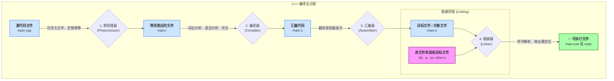

```mermaid
graph TD
    subgraph "C++ 编译全过程"
        A["<b>源代码文件</b><br/>main.cpp"] -- "包含头文件、宏替换等" --> B{"1. 预处理器<br/>(Preprocessor)"};
        B --> C["<b>预处理后的文件</b><br/>main.i"];
        C -- "词法分析、语法分析、优化" --> D{"2. 编译器<br/>(Compiler)"};
        D --> E["<b>汇编代码</b><br/>main.s"];
        E -- "翻译成机器指令" --> F{"3. 汇编器<br/>(Assembler)"};
        F --> G["<b>目标文件 / 对象文件</b><br/>main.o"];
        
        subgraph "链接阶段 (Linking)"
            G --> H{"4. 链接器<br/>(Linker)"};
            I["<b>库文件和其他目标文件</b><br/>.lib, .a, .so, other.o"] --> H;
        end

        H -- "符号解析、地址重定位" --> J["✨ <b>可执行文件</b><br/>main.exe 或 main"];
    end

    %% Styling
    style A fill:#cde4ff,stroke:#6699ff,stroke-width:2px
    style C fill:#cde4ff,stroke:#6699ff,stroke-width:2px
    style E fill:#cde4ff,stroke:#6699ff,stroke-width:2px
    style G fill:#cde4ff,stroke:#6699ff,stroke-width:2px
    style I fill:#f9f,stroke:#939,stroke-width:2px
    style J fill:#aaffaa,stroke:#339933,stroke-width:2px
```