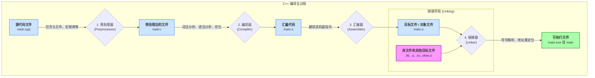

**当我们在谈论编译时，我们在谈些什么？**

高级编程语言的出现，是在寻找一种贴近自然语言的方式来驱使机器。

编译器本质上在做同一件事情——把人类写的高级文本翻译成计算机硬件（CPU）能够直接执行的“0101”机器码。

但是编译器并不负责把机器码送进 CPU，谁来负责呢？操作系统。

这并不是无条件的，操作系统会确立了一个规范（ABI），它只认符合规范的格式，如 Linux 的 ELF 格式、Windows 的 PE/COFF 格式。

> 所以，编译器天然平台相关。

格式虽然有差异，但内容是相似的，都是包含代码段、数据段、符号表的二进制文件，这就是编译得到的最终产物，

为了让操作系统看得懂，编译器必须经历“把代码翻译成机器码（汇编/编译）”以及“把各个模块的符号地址对齐修正（链接）”的过程。


```mermaid
graph TD
    subgraph "C++ 编译全过程"
        A["<b>源代码文件</b><br/>main.cpp"] -- "包含头文件、宏替换等" --> B{"1. 预处理器<br/>(Preprocessor)"};
        B --> C["<b>预处理后的文件</b><br/>main.i"];
        C -- "词法分析、语法分析、优化" --> D{"2. 编译器<br/>(Compiler)"};
        D --> E["<b>汇编代码</b><br/>main.s"];
        E -- "翻译成机器指令" --> F{"3. 汇编器<br/>(Assembler)"};
        F --> G["<b>目标文件 / 对象文件</b><br/>main.o"];
        
        subgraph "链接阶段 (Linking)"
            G --> H{"4. 链接器<br/>(Linker)"};
            I["<b>库文件和其他目标文件</b><br/>.lib, .a, .so, other.o"] --> H;
        end

        H -- "符号解析、地址重定位" --> J["<b>可执行文件</b><br/>main.exe 或 main"];
    end

    %% Styling
    style A fill:#cde4ff,stroke:#6699ff,stroke-width:2px
    style C fill:#cde4ff,stroke:#6699ff,stroke-width:2px
    style E fill:#cde4ff,stroke:#6699ff,stroke-width:2px
    style G fill:#cde4ff,stroke:#6699ff,stroke-width:2px
    style I fill:#f9f,stroke:#939,stroke-width:2px
    style J fill:#aaffaa,stroke:#339933,stroke-width:2px
```

这个过程通常可以分为四个主要阶段：

1. 预处理（Preprocessing）
2. 编译（Compilation）
3. 汇编（Assembly）
4. 链接（Linking）

四阶段模型（预处理 → 编译 → 汇编 → 链接），不是某个机构"规定"的，而是工程实践与计算机体系结构共同演化出的必然结果。

Unix 系统推崇**"每个工具只做一件事，并做好"**的哲学。1969–1973 年间，Dennis Ritchie 在开发 C 语言，当时的编译环境并非一个单体程序，而是多个独立工具的组合：

| 阶段 | 早期 Unix 工具 | 职责 |
|------|---------------|------|
| 预处理 | `cpp` (C PreProcessor) | 处理 `#include`、`#define`、条件编译 |
| 编译 | `cc` (C Compiler) | 将 C 代码翻译成汇编 |
| 汇编 | `as` (Assembler) | 将汇编翻译成机器码（目标文件 `.o`） |
| 链接 | `ld` (Linker) | 将多个目标文件和库合并为可执行文件 |

等到 Bjarne Stroustrup 在 1979 年起 引入 C++ 的时候，直接复用了这套成熟的工具链架构。

四阶段模型简单而优雅，即使今天有人想写一个"一体化"编译器，这四个阶段的分离仍是工程最优解。

以一个简单的 C++ 程序为例，看看一段 C++ 代码是怎样转换成可被 OS 识别的可执行程序的。

```c++
#include <iostream>

#define GREETING "Hello, C++!"

int main() {
    std::cout << GREETING << std::endl; // say hello
    return 0;
}
```

在不同的编译器，编译这段代码将会是这样的：
- GCC: g++ main.cpp -o main
- Clang: clang++ main.cpp -o main
- MSVC: cl main.cpp /Fe:main.exe

为了方便，我使用 gcc (Ubuntu 13.3.0-6ubuntu2~24.04.1) 13.3.0 来编译这段程序。

### 1. 预处理 
  - 处理以 `#` 开头的指令，将 `#include` 的头文件内容插入到源文件中 ，根据 `#ifdef`、`#else` 等条件编译决定哪些代码保留。
  - 展开宏定义，把宏替换为实际内容。
  - 删除注释。
  - 输出一个“纯净”的临时文件，通常以 `.i` 或 `.ii` 后缀保存。
  -  预处理不检查语法错误，只是机械地替换和展开。
 
 用 GCC 运行：

  ```bash
  g++ -E main.cpp -o main.i
  ```

 得到的 [main.i ](https://gist.github.com/coldowl/d32f24877d45b784ddc4665fb1c58872)有上万行，因为 iostream 头文件内容被全部插入。

### 2. 编译 
  - 编译器分析代码的语法和语义，检查是否有错误（比如变量未声明、类型不匹配）。
  - 将 C++ 代码翻译成目标平台的汇编语言（低级语言，接近机器码）。
  - 生成的汇编代码以 `.s` 文件形式存储。
  - 编译器会优化代码，比如内联函数、删除无用代码（死代码消除）。
  - 这一步生成的代码还不能直接运行，因为它只是汇编语言。

 用 GCC 运行：
  ```bash
  g++ -S main.i -o main.s
  ```
  [main.s](https://gist.github.com/coldowl/1d1e0ba4f874e3d7f014786c7675f1b5)文件就是汇编代码，里面是针对特定 CPU 架构的指令。

### 3. 汇编 
  - 汇编器（Assembler）将 `.s` 文件中的汇编指令转换为二进制机器码。
  - 生成目标文件（Object File，通常是 `.o` 或 `.obj` 文件），包含机器码和符号表（记录函数、变量的地址等）。
  - 目标文件是特定平台的二进制代码，但还不能运行，因为它可能引用了其他文件中的代码或库。

  用 GCC：
  ```bash
  as main.s -o main.o
  ```
  （通常 `g++` 会自动调用汇编器。）

这一步得到的 [mian.o](https://gist.github.com/coldowl/cd782501041513e1b2776f9ab21c59d7) 已经是不可阅读的二进制文件了。
文件开头的 0x7F 接着 ASCII 字符 E、L、F，表明它是 ELF 格式的二进制文件。

```plain
┌─────────────────┐
│    ELF Header   │  ← 文件类型、架构、入口地址、头表位置等元信息
├─────────────────┤
│ Program Header  │  ← 运行时视角：告诉 OS "我需要哪些内存段（Segment）"
│    Table        │
├─────────────────┤
│     .text       │  ← 代码段（机器指令）
│     .rodata     │  ← 只读数据（字符串常量、const 变量）
│     .data       │  ← 已初始化全局/静态变量
│     .bss        │  ← 未初始化全局/静态变量（不占文件空间，只占内存）
│     ...         │
├─────────────────┤
│ Section Header  │  ← 链接时视角：告诉链接器 "我有哪些节（Section）"
│    Table        │
└─────────────────┘
```

### 4. 链接 
  - 链接器（Linker）将程序的多个 `.o` 文件、静态库（`.a`）或动态库（`.so`、`.dll`）组合起来。
  - 解析符号引用（比如 `std::cout` 的实际地址）。
  - 分配内存地址，确定每个函数和变量的最终位置。
  - 生成最终的可执行文件（`.exe` 或无后缀的二进制文件）。
   - 链接分为**静态链接**（把库代码直接打包进可执行文件）和**动态链接**（运行时加载库）。
  - 链接错误（比如“undefined reference”）通常是因为缺少库或符号未定义。

  在上面的代码中，`std::cout` 和 `std::endl` 是标准库中的符号。链接器会找到标准库（比如 `libstdc++`）的实现，把它们的地址填入代码。

  链接过程相当繁琐，如果纯用 ld 手动链接，需要显式把系统的启动文件、C++ 运行库全部喂给 ld。不如用 GCC 完成整个编译，但是通过 -v（verbose）参数看看底层到底做了什么。

  ```bash
 g++ -v main.o -o main
  ```

从[完整的输出](https://gist.github.com/coldowl/27c26a92152e1732e445ae8de8fb21f4)中，拆解出的链接过程将会是：

```bash
/usr/libexec/gcc/x86_64-linux-gnu/13/collect2 \
    # === LTO 插件（链接时优化）===
    -plugin /usr/libexec/gcc/x86_64-linux-gnu/13/liblto_plugin.so \
    -plugin-opt=/usr/libexec/gcc/x86_64-linux-gnu/13/lto-wrapper \
    -plugin-opt=-fresolution=/tmp/ccyN0pSi.res \
    -plugin-opt=-pass-through=-lgcc_s \
    -plugin-opt=-pass-through=-lgcc \
    -plugin-opt=-pass-through=-lc \
    -plugin-opt=-pass-through=-lgcc_s \
    -plugin-opt=-pass-through=-lgcc \
    
    # === 链接器基本配置 ===
    --build-id \              # 生成 .note.gnu.build-id（用于调试和区分版本）
    --eh-frame-hdr \          # 生成异常处理帧头（C++ 异常机制需要）
    -m elf_x86_64 \           # 目标格式：64 位 ELF
    --hash-style=gnu \        # 使用 GNU 风格的符号哈希表（加速动态链接）
    --as-needed \             # 按需链接共享库（避免引入无用依赖）
    -dynamic-linker /lib64/ld-linux-x86-64.so.2 \  # 指定动态链接器路径
    -pie \                    # 生成位置无关的可执行文件（PIE）
    -z now \                  # 立即绑定所有符号（RELA NOW）
    -z relro \                # 启用只读重定位（增强安全性）
    -o main \                 # 输出文件名
    
    # === C 运行时启动文件（入口点 _start 在这里）===
    /usr/lib/gcc/x86_64-linux-gnu/13/../../../x86_64-linux-gnu/Scrt1.o \
    /usr/lib/gcc/x86_64-linux-gnu/13/../../../x86_64-linux-gnu/crti.o \
    /usr/lib/gcc/x86_64-linux-gnu/13/crtbeginS.o \
    
    # === 库搜索路径 ===
    -L/usr/lib/gcc/x86_64-linux-gnu/13 \
    -L/usr/lib/gcc/x86_64-linux-gnu/13/../../../x86_64-linux-gnu \
    -L/usr/lib/gcc/x86_64-linux-gnu/13/../../../../lib \
    -L/lib/x86_64-linux-gnu \
    -L/lib/../lib \
    -L/usr/lib/x86_64-linux-gnu \
    -L/usr/lib/../lib \
    -L/usr/lib/gcc/x86_64-linux-gnu/13/../../.. \
    
    # === 你的目标文件 ===
    main.o \
    
    # === 需要链接的库（顺序很重要！）===
    -lstdc++ \    # C++ 标准库（你缺的）
    -lm \         # 数学库
    -lgcc_s \     # GCC 共享支持库（异常处理、64 位除法等）
    -lgcc \       # GCC 静态支持库
    -lc \         # C 标准库（libc）
    -lgcc_s \     # 再重复一次，处理循环依赖
    -lgcc \       # 再重复一次
    
    # === C 运行时收尾文件 ===
    /usr/lib/gcc/x86_64-linux-gnu/13/crtendS.o \
    /usr/lib/gcc/x86_64-linux-gnu/13/../../../x86_64-linux-gnu/crtn.o
```

不难看到，g++ 在底层调用 collect2 或 ld 时，带了一长串系统的启动目标文件（crt*.o）和一堆库：-lstdc++ -lm -lgcc_s -lc 等等。
这也是为什么平时我们永远使用 g++ 作为前端驱动程序，而不是直接裸用 ld 的原因——太繁琐了。